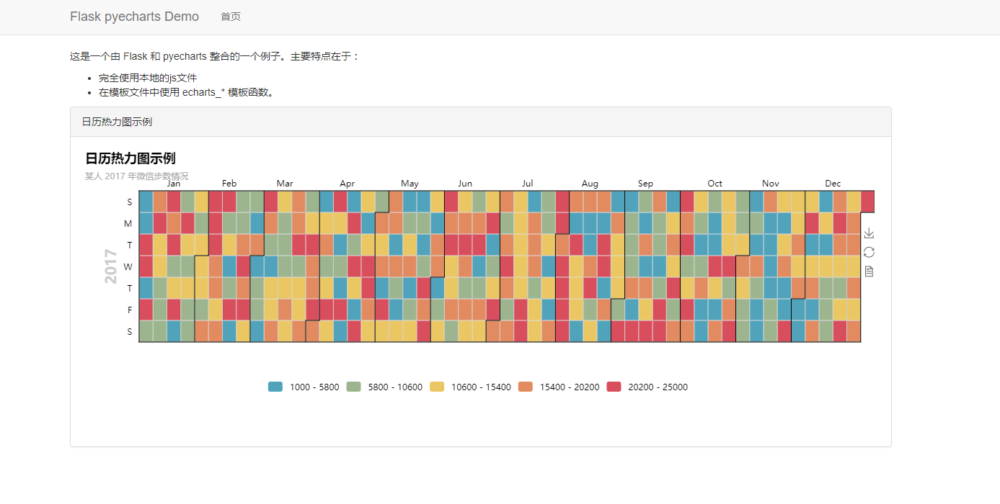

# Flask_demo

## 概述

这是一个使用 flask 和 pyecharts (V0.3.0+)整合的一个示例项目，主要特点：

- 整合 Flask 应用默认的模板引擎
- 完全使用本地的 js/css 等静态文件
- 模板文件可以使用模板文件

## 使用

1 安装依赖库

```shell
pip install requirements.txt
```

2 进入目录，运行脚本

```shell
python flask_demo.py
```

3 预览，访问浏览器 http://127.0.0.1:10200 即可。

